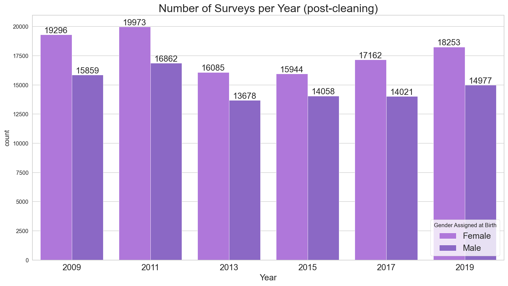
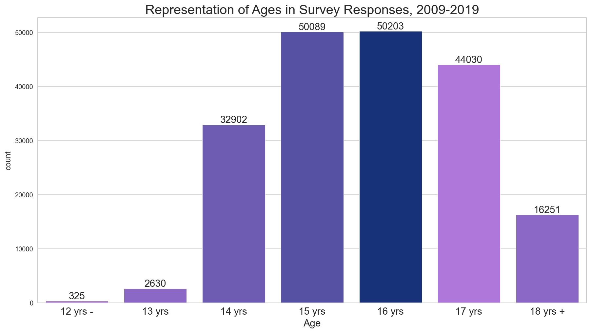
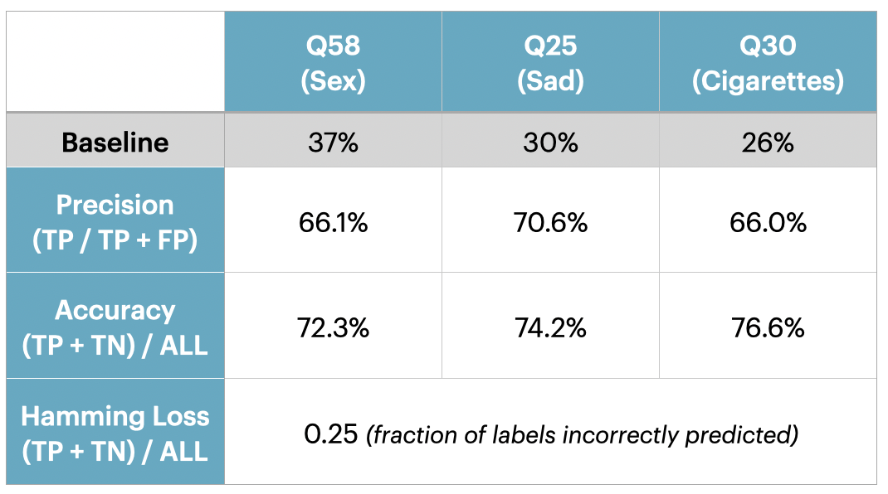

# Predicting Youth Risk Behaviors: Modeling the YRBSS  
Becky Peters, Data Scientist 
github.com/beckyepeters 
linkedin.com/beckyepeters 
becky.e.peters@gmail.com 

### Background and Motivation 
*Please see the pdf of the presentation (['RiskBehaviors.pdf'](https://github.com/beckyepeters/risk_behaviors/blob/main/RiskBehaviors.pdf) in this repository) for more information about the tech stack, future work, and screenshots of the dashboard (local development).* 

I will use the analogy of jellyfish in the ocean to describe risky behaviors in one's youth. Part of my job as a mom (or a doctor's job with their pediatric patients, or a teacher's / counselor's job with their students) is to partner with youth to help them make choices as they develop throughout their lives. Youth deserve accurate information about the consequences of their behaviors, as well as about the possibility of these choices arising in their lives. Of course, there are so many things to navigate as you develop into adulthood; we can't throw all the jellyfish at them at once and expect them to make good decisions. We have to help them navigate the water by talking about risk and helping them make informed and appropriate decisions about their lives and discuss with them how it may impact their future. 

The [Centers for Disease Control and Prevention](https://www.cdc.gov/) (CDC) supports us with this information through their Youth Risk Behavior Survey, a biannual survey conducted across the nation since 1999. The YRBS (conducted by the CDC, state, territorial, and local education and health agencies and tribal governments) surveys youth from across the country about health-related behaviors that contribute to leading causes of death and disability among youth and adults, including (listed from [the YRBSS website](https://www.cdc.gov/healthyyouth/data/yrbs/index.htm)): 
* Behaviors that contribute to unintentional injuries and violence
* Sexual behaviors related to unintended pregnancy and sexually transmitted diseases 
* Alcohol and other drug use
* Tobacco use
* Unhealthy dietary behaviors
* Inadequate physical activity

Purpose of the Project / Model: 
* To provide individually-based predictions of probability to professional end-users (health care providers, schools, counselors, etc) that will support them with: 
    * engaging in individual discussions with the youth in their care, and
    * making programming decisions to maximize outreach efforts.
* To improve upon the baseline accuracy of 'x% of people your age or gender or race engaged in this activity' as available now through the comprehensive [YRBSS online dashboard](https://yrbs-explorer.services.cdc.gov/#/)
* To better understand the world in which my kids are growing up. 

Other Considerations: 
1. Insights over Answers: 
    * Certainly a high probability of a person engaging in an activity does not mean that person has.
2. Discussions over Discipline:  
    * The hope is that adult knowledge of the prevalence of these risk behaviors will lead to more appropriate, relevant conversations with young pepole about their own health. 
3. Reality over Determinism: 
    * Even if the model were 100% accurate, actual choices are impossible to predict for individual people.  

### Exploring the Data
* Data were cleaned as follows: 
    * Retained 10 years of survey data (2009-2019)
    * Removed ancillary survey questions that were not asked every year the survey was administered
    * Removed NaN responses for the 3 target survey questions (Q58, Q25, Q30)
    * Filled NaN responses with k-Nearest Neighbors Imputation

The number of surveys taken per year remained relatively uniform over the ten years of data considered for this project. 

Figure 1: Number of Surveys Completed per Year, by Gender Assigned at Birth

The age distribution ranged from 12 years old to 18 years old, with the majority of respondents as 15 and 16 year olds. 
Figure 2: Age Distribution

The respondents were primarily Hispanic / Latinx, Black / African American, and White. 
Figure 3: Race / Ethnicity Distribution

The three targets for classification represented relatively imbalanced classes, which needed to be addressed in each of the different algorithms chosen for experimentation. 
Figure 4: Three Targets Distribution

### Modeling, Predictions, and Conclusions
* Of the many algorithms with which I experimented for the best metrics results, the Random Forest performed the best in the least amount of time, with the following metrics and confusion matrix results: 

Figure 5: Classification Metrics for Algorithm Evaluation 

Figure 6: Confusion Matrix for highest-performing Random Forest Algorithm 
 

Using Grid Search CV and a consistent number for the random_state parameter, I found the best performing algorithm to be a Random Forest with the following parameters: 
* criterion = 'entropy'
* max_depth = 17
* max_features = 17
* n_estimators = 300

Figure 7: Cytoscape of Connected Behaviors, taken on a representative subsample of 10,000 survey responses
 

### Future Work 
Overall the project provided insight into some commonly linked risk behaviors, the features important to prediction (listed in the dashboard dropdowns), and the difficulties of predicting individual behaviors from accumulated survey data.  

I also discovered that the dashboard would have to be very individualized depending on the audience. If it were strictly for parents, I could increase accuracy, hamming loss, and precision quite a bit by assuming the most frequent answer (which was more often than not the negative answer) for many of the survey questions, and then as you learned more about your child and their habits you could update your previous predictions. For example, if I learned that my child had tried smoking marijuana (question 45, and the most important feature for prediction if all survey responses are left in the model), then my accuracy and precision on the other classifications would increase as well. However, I ended up building this dashboard on the mostly knowable responses that parents should be able to answer about their children without knowing their risk behavior history. For future work it would be interesting to make different versions of the dashboard for different users, depending on their tolerance level for misclassifications. We could also change the threshold of prediction for each classifier depending on the different audiences.  

I'd love to add a geographic feature as well. As it stands, the model predicts on the site with the most survey results over the 10 years which is New York City. I'm sure some of the other districts surveyed would provide enough diversity in response that a user of the dashboard could 'choose a geographic area like mine', either on the basis of political leanings or geographic proximity or simply population size, and that would have an affect on the predictions as well. 

### Data Sources and Primary Resources for Project
* Data Resources: 
    * [YRBSS Publicly Available Datasets](https://www.cdc.gov/healthyyouth/data/yrbs/data.htm) 
    * This project used the 'National YRBS Datasets and Documentation' (grey section), then accessed the 2019 Data (downloaded the [Access Database file](https://www.cdc.gov/healthyyouth/data/yrbs/files/2019/XXH2019_YRBS_Data.zip) and exported tables to python using [mdbtools](https://github.com/mdbtools/mdbtools))
    * [User's Guide for the 2019 YRBS National, State, and District Combined Datasets](https://www.cdc.gov/healthyyouth/data/yrbs/pdf/2019/2019_YRBS_SADC_Documentation.pdf)
* Coding Resources: 
    * [MDB Tools on GitHub](https://github.com/mdbtools/mdbtools)

### Other Citations and References 
* [Let's Talk About Sex, Maybe](https://www.coloradohealthinstitute.org/research/lets-talk-about-sex-maybe); Colorado Health Institute, accessed Aug 2021